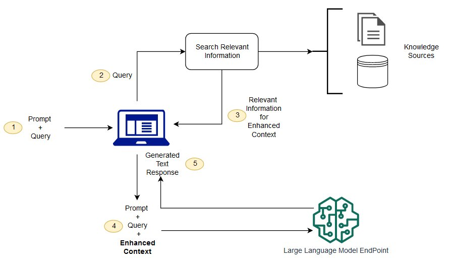

# Generative AI ChatBot

## Overview
This repository contains two projects:
1. **Custom Chatbot** using `tiiuae/falcon-7b-instruct`
2. **RAG Implementation** integrating custom data with pre-trained models

### Key Concepts

- **RAG (Retrieval-Augmented Generation):** Enhances language models by retrieving relevant data to generate accurate responses.
- **Vector Stores:** Efficiently store and retrieve high-dimensional vectors for similar item searches.

### Tech Stack (RAG)
- **Model:** `tiiuae/falcon-7b-instruct`
- **Embeddings:** `BAAI/bge-small-en-v1.5`
- **Vector Store:** FAISS
- **GUI:** Streamlit
- **Orchestration:** LangChain

## Setup Instructions

### 1. Create a Virtual Environment
```
python -m venv myEnv
# for Apple/Bash use `source myEnv/bin/activate`  
# On Windows use `.\myEnv\Scripts\activate`
pip install -r requirements.txt
```
### 2. Running the Projects Scripts
```
Custom Chatbot: `streamlit run SimpleChat.py`
RAG Chatbot: `streamlit run Rag.py`
```

### Note: Create API TOKEN from hugging face and add it in .env file with key HUGGINGFACEHUB_API_TOKEN
